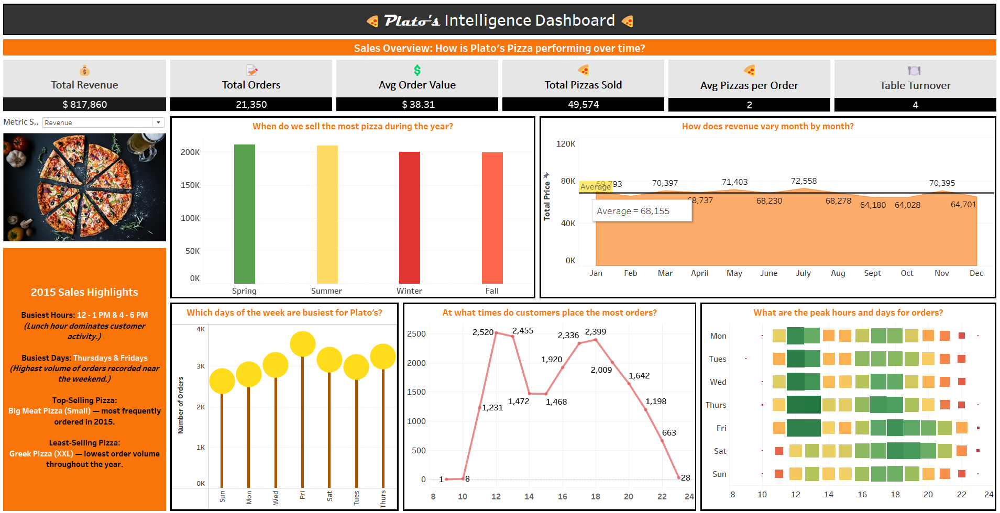
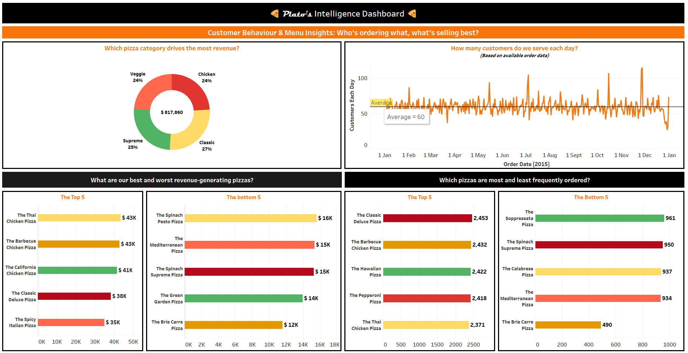
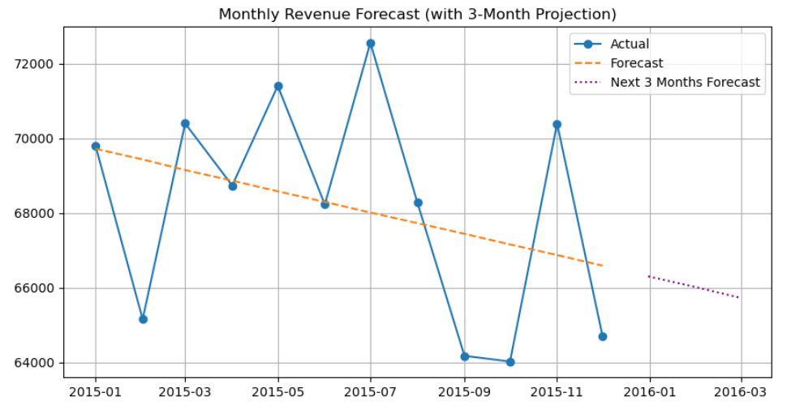
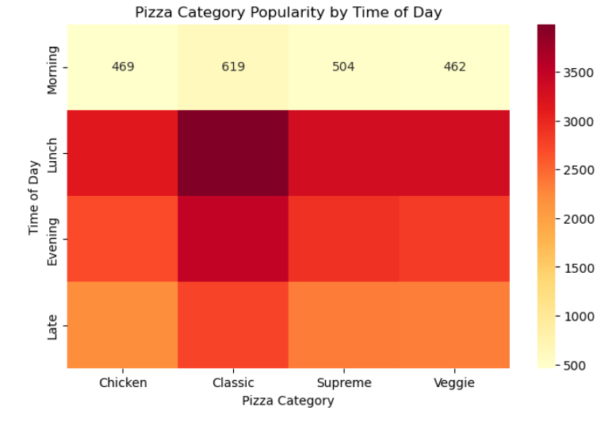

# Pizza-Sales-Analysis
Data insights and dashboard for Plato’s Pizza using Excel, Tableau, and Python.

## Table of Contents
- [Objective](#objective)
- [Business Questions](#business-questions-answered)
- [Data Cleaning](#-ata-cleaning--preparation)
- [KPIs](#key-performance-indicators-kpis)
- [Dashboards](#dashboard-preview)
- [Insights](#key-insights--recommendations)
- [References](#references)

# 🍕 Pizza Sales Analysis for Plato’s Pizza  
**Role:** Business Intelligence Consultant  
**Location:** New Jersey  
**Tools Used:** Tableau • Excel • Python • GitHub

### Objective
The goal of this project was to analyze one year of sales data for Plato’s Pizza to identify:
- Revenue patterns and peak sales periods
- Customer ordering behaviors
- Best and worst-performing products
- Operational insights (like table turnover)
The final outcome was to present data-backed recommendations to improve sales and optimize daily operations.

### Business Questions Answered
1. What days and hours do we receive the most orders?
2. How many pizzas are sold during peak periods?
3. Which pizzas perform best or worst by revenue and quantity?
4. What is our average order value?
5. How well are we utilizing our 15 tables and 60 seats?
6. What was the total revenue generated last year?

### Key Performance Indicators (KPIs) 📊
| KPI                      | Description                          |
| ------------------------ | ------------------------------------ |
| **Total Revenue**        | Overall revenue earned in 2015       |
| **Total Orders**         | Number of orders placed              |
| **Average Order Value**  | Revenue per order                    |
| **Total Pizzas Sold**    | Total quantity of pizzas sold        |
| **Avg Pizzas per Order** | Avg. quantity per order              |
| **Table Turnover Rate**  | Estimated based on avg. daily orders |


### Areas of Analysis & Visualizations
- Monthly Revenue Trends – how did revenue fluctuate over the year?
- Seasonal Insights – which seasons performed best?
- Hourly Sales Patterns – what hours are the busiest?
- Busiest Days of the Week – when are orders highest?
- Customer Volume Estimates – how many customers visit per day?
- Revenue by Pizza Category – what categories drive sales?
- % of Pizzas Sold by Category – volume-based category insights
- Top/Bottom 5 Pizzas by Revenue
- Top/Bottom 5 Pizzas by Quantity

### Data Cleaning & Preparation
- Checked for blanks and duplicates (none found)
- Ensured correct data types:
  - `order_date` as **Date**
  - `order_time` as **Time**
  - `total_price` and `unit_price` formatted with **USD ($)**
- Created new columns in Excel to support analysis:
  - **Month & Day** from `order_date` using:
  ```excel
  =TEXT(order_date, "mmmm")
  =TEXT(order_date, "dddd")
  ```
  - Hour from `order_time` using:
  ```excel
  =HOUR([@[order_time]])
  ```
  - Season assigned using:
  ```excel
  =CHOOSE(MONTH(order_date),
  "Winter", "Winter", "Spring", "Spring", "Spring",
  "Summer", "Summer", "Summer",
  "Fall", "Fall", "Fall", "Winter")
  ```
  - Pizza Size Labels mapped from codes (S, M, L, XL, XXL) using:
  ```excel
  =IF(size="S","Small",IF(size="M","Medium",...))
  ```
- Prepared the final cleaned dataset for Tableau by:
  - Removing all formulas
  - Flattening calculated fields into values
  - Saving as a new file: Pizza Sales - final_Cleaned.xlsx
 
### What’s Next ❓
This project was completed using both visual tools (Tableau) and code-driven analysis (Python) to provide a full-stack business intelligence solution.
Additional deep-dives included:
 - Revenue Forecasting using Linear Regression
 - Time-of-Day Analysis by Pizza Category (heatmap)
  
### Dashboard Preview

#### Sales & Growth Monitor


#### Customer Behavior & Category Insights


### Trend Forecasting (Linear Regression)

This plot shows monthly revenue over the year and a predicted trend using linear regression.




### Order Frequency by Time of Day vs Pizza Category



### Insights & Recommendations

#### Sales Trends Over Time
  - Sales were highest in July, with over **$72,000** in revenue.
  - **Spring** and **Summer** were the busiest seasons, with the most orders.
  - On average, the restaurant got **60** orders per day.
  - Peak hours were **12–1 PM** and **6–8 PM** — perfect lunch and dinner times.
  - **Thursdays** and **Fridays** were the busiest days of the week.
#### Recommendations:
  - Add more staff and prep more ingredients during peak times.
  - Run offers on Thursday/Friday lunch and dinner to boost revenue.
  - Plan seasonal deals in Spring and Summer to take advantage of high demand.

#### Best & Worst Performing Pizzas
  - The **Classic** **Deluxe** and **Barbecue** **Chicken** pizzas were top favorites in both sales and revenue.
  - **Brie Carre** and **Greek Pizza** **(XXL)** were the least popular.
#### Recommendations:
  - Highlight top-sellers in combo meals and marketing.
  - Consider removing or reworking poorly performing pizzas to reduce waste and menu clutter.

#### Category & Size Insights
  - **Classic** and **Supreme** pizzas made up more than **50%** of total revenue.
  - **Medium** and **Large** sizes were ordered the most.
  - Very few customers ordered XXL pizzas.
#### Recommendations:
  - Stock more ingredients for medium and large pizzas.
  - Focus new product launches in the Classic and Supreme categories.
  - Rethink XXL pizzas — maybe turn them into limited-time offers.

#### Sales Forecast (Python Analysis)
  - A simple forecast shows sales might slightly dip in the next 3 months.
  - This could be due to off-season periods or customer fatigue.
#### Recommendations:
  - Introduce new items or limited-time deals to keep customers interested.
  - Keep tracking the forecast and update it every quarter for better planning.

#### Pizza Category vs. Time of Day (Python Heatmap)
  - Classic pizzas were most popular during lunch.
  - Other categories (like Supreme and Veggie) had steady orders throughout the day.
  - Late-night orders were low across the board.
#### Recommendations:
  - Create lunch combos with Classic pizzas to boost sales even more.
  - Reduce late-night staffing or offer special “late-night meal deals” to increase traffic.

#### References
[(https://www.youtube.com/@datatutorials1)]

